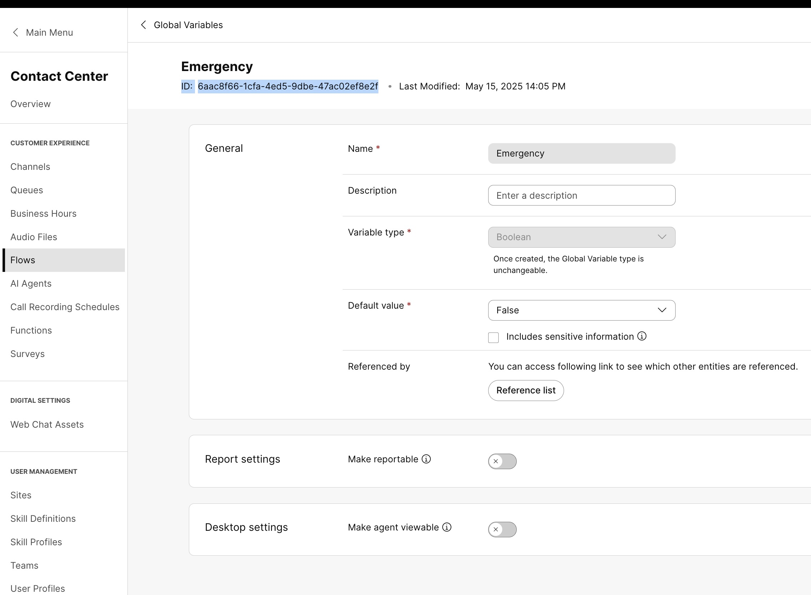
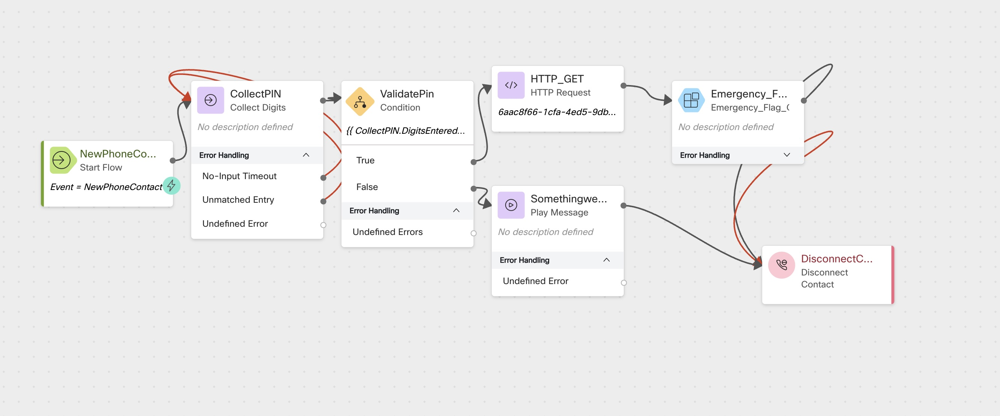
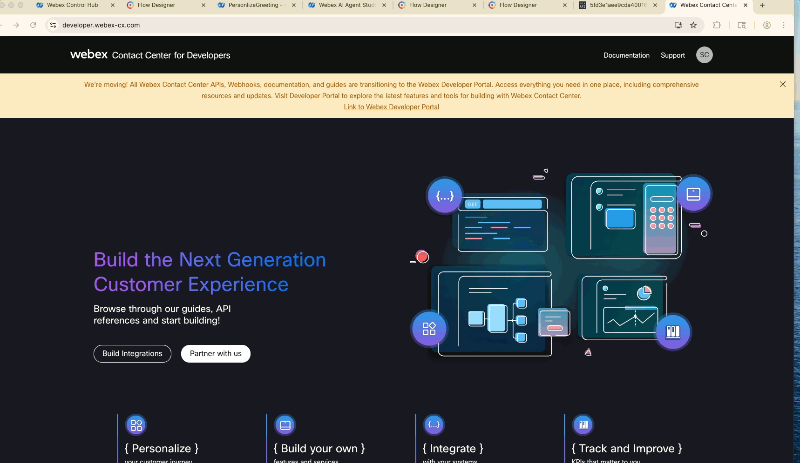

# Dynamically Controlling Emergency Flag in Webex Contact Center Using API

## Story

In this lab, you will learn how to **dynamically change the Emergency flag** in a Webex Contact Center (WxCC) environment by calling a script as a **Supervisor or Administrator**. This enables real-time routing behavior adjustments — such as diverting calls to a special queue or playing emergency announcements — during critical situations like outages or weather alerts.

---

### High-Level Explanation

> A call enters the **IVR flow**.
> 
> The **caller is prompted to enter a Supervisor/Administrator pin**.
> 
> If the password is correct:
  >> The **current status** of the Emergency flag is **retrieved and played back** (e.g., *Emergency flag is currently ON/OFF*).

  >> The caller is then **offered an option to change the Emergency status**.

> Based on the caller's choice, the script **invokes a WxCC API** (via connector) to **update the Global Variable** controlling Emergency Flag.
> 
> This flag controls downstream behavior in the flow (e.g., route to emergency queue or play special message).

---

## Preconfigured Elements

1. **Connector**:
   > A connector is available in the flow to call **Webex Contact Center APIs**.
  >> It is used to **read and update** the Emergency flag via API.

2. **Supervisor PIN**:
   > The password required for authentication is: `9638`.


### Create below Global  Flow Variables

> Navigate to ControlHub > Contact Center > Flows > Global Variables > Create a Global Variable

> Name: <copy>CL<w class="POD"></w>_Emergency</copy> 
>
> Variable type: Boolean
>
> Default Value:```False```
>
> Copy the ID  (it will be used as the default value of ```Global_ID``` Flow Variable)

### <details><summary>Show Me</summary></details>

### Create a new flow
> Create a new flow named <copy>CL<w class="POD"></w>_emer</copy>

### Create these Local Flow Variables
> Name: <copy>HTTPStatusVar</copy>
>
> Type: String
>
> Default Value: Leave Empty
---
> Name: <copy>Emergency_Value_Check</copy>
>
> Type: String
>
> Default Value: Leave Empty

---
> Name: <copy>Global_ID</copy>
>
> Type: String
>
> Default Value: < ID copied from Global Variable>
---
> Name: <copy>Global_Name</copy>
>
> Type: String
>
> Default Value: <copy>CL<w class="POD"></w>_Emergency</copy> 
---

### Tag  Global  Variables in the flow 

> Under Global variable 
>
> Click ```Add Global Variables```
>
> Search with your Pod id <copy><w class="POD"></w></copy> 
>
> Select and Add the Global Variable 

---
### Add a Collect Digits node
> Activity Label: <copy>CollectPIN</copy>

> Connect the New Phone Contact output node edge to Collect Digit node
>
> Enable Text-To-Speech
>
> Select the Connector: Cisco Cloud Text-to-Speech
>
> Click the Add Text-to-Speech Message button
>
> Delete the Selection for Audio File
>
> Text-to-Speech Message: <copy>Please enter 4 digits pin code to activate emergency flow</copy>
>
---

### Add a Condition node
> Activity Label: <copy>ValidatePin</copy>
>
> Expression: <copy>`{{ CollectPIN.DigitsEntered == "9638"}}`</copy>
>
> Connect the True node edge to the HTTP Request node, in the next step you will learn HTTP Configuration
>
> Link the Collect Digit Node to Conditon Node 
>
---

### Add a HTTP Request Node
> Activity Label: <copy>HTTP_GET</copy>

> Under Connector Select ```Wxcc_API``` 

> Request Path: <copy>`/organization/e56f00d4-98d8-4b62-a165-d05a41243d98/cad-variable/{{Global_ID}}`</copy>

> Under Connector Select ```GET``` 
>
> Under Connector Select ```Application/JSON``` 
>

> ParseSetting 

>  Content Type -- ```JSON``` 
> 
>  OutPutVariable -- ```Emergency_Value_Check```
> 
> Path Expression -- ```$.defaultValue``` 
>
> Link the True path from the condition node to HTTP node 

---
### Add a Play  node
> Connect the False node edge of condition node to the play  message node
>
> Activity Label: <copy>SomethingwentWrongMsg</copy>
>
> Enable Text-To-Speech
>
> Select the Connector: Cisco Cloud Text-to-Speech
>
> Click the Add Text-to-Speech Message button
>
> Delete the Selection for Audio File
>
> Text-to-Speech Message: <copy>Some thing went wrong please reach out to your Administrator.</copy>
>

---

### Add a Subflow node
> Name: Emergency_Flag_OnOff
>
> Connect the HTTP_GET node  to this Subflow node
>
> Subflow Label: Live
>
> Map Subflow Input Variables
>
>> Click Add New
>>
>> Current Flow Variable: <copy>Global_ID</copy>
>>
>> Subflow Input Variable: <copy>GV_ID</copy>
> 
> 
>> Click Add New
>>
>> Current Flow Variable: <copy>Global_Name</copy>
>>
>> Subflow Input Variable: <copy>GV_Name</copy>

> Click Add New
>>
>> Current Flow Variable: <copy>Emergency_Value_Check</copy>
>>
>> Subflow Input Variable: <copy>Emergency_Value_Check1</copy>
>

---

### Add a Disconnect Contact node
> Connect the Output node edge from the Subflow and play message node to this Disconnect Contact node
>
---

### <details><summary>Check your flow</summary></details>

---
### Publish your flow
> Turn on Validation at the bottom right corner of the flow builder
>
> If there are no Flow Errors, Click Publish
>
> Add a publish note
>
> Add Version Label(s): Live 
>
> Click Publish Flow

---


### Map your flow to your inbound channel
> Navigate to Control Hub > Contact Center > Channels
>
> Locate your Inbound Channel (you can use the search): <copy><w class="EP"></w></copy>
>
> Select the Routing Flow: <copy>CL<w class="POD"></w>_emer</copy>
>
> Select the Version Label: Live
>
> Click Save in the lower right corner of the scree

---

## Testing the Emergency Control Flow

1. Call into the **Emergency Control Script** using your assigned **Inbound Channel Number**
2. When prompted, enter the **Supervisor/Administrator Pin**: `9638`
3. You will hear the **current status** of the Emergency flag (e.g., *Emergency mode is OFF*)
4. Press **1** to enable Emergency mode
5. Open the **Webex Contact Center Developer Portal** and **verify that the global variable value is now set to `true`** 
    <details><summary>Show Me</summary></details>
6. Call the script again and **enter the Pin `9638`**
7. This time, **press 1 again to disable Emergency mode**
8. Return to the **Developer Portal** and verify that the **Emergency flag is now set to `false`**
    <details><summary>Show Me</summary></details>

---

## Debugging the Flow

> Open the **Debugger** in the Flow Builder
> Select the **last interaction** from the top of the list
> Trace the call steps
  >> You can view the **path**, **input/output variables**, and **events**

---

# Once you have completed the testing, go pick another adventure from the [Adventure Section](adventureList.md)