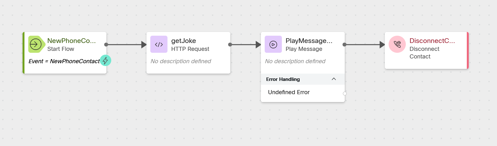

# Dial-A-Dad-Joke

## Story
> Not every learning exercise needs to be overly serious.  This exercise is a fun way to explore the basics of and http request, JSON, text-to-speech, and basic flow logic, all while getting a little giggle.  

In this lab we will be using https://icanhazdadjoke.com to retrieve a Dad Joke via API

## Build

### Create a new flow
> Create a new flow named <copy>CL<w class="POD"></w>_DadJoke</copy>
 
---

### Create a flow variable
> Name: <copy>joke</copy>
>
> Variable Type: <copy>String</copy>
> 

---

### Add an HTTP Request node
> Activity Label: <copy>getJoke</copy>
>
> HTTP Request Settings:
>
>> Use Authenticated Endpoint: False
>>
>> Request URL: <copy>https://icanhazdadjoke.com/</copy>
>>
>> Method: <copy>GET</copy>
>> 
>> HTTP Request Headers: 
>> 
>>> Key: <copy>Accept</copy>  Value: <copy>application/json</copy>
>>> 
>>> 
>>
>> Content Type: <copy>Application/JSON</copy>
>>
> 
> Parse Settings:
>
>> Content Type: <copy>JSON</copy>
>>
>>> Output Variable: <copy>joke</copy>
>>>
>>> Path Expression: <copy>$.joke</copy>
>>
> Connect the New Phone Contact output node edge to this HTTP Request node
---

### Add a Play Message node 
> Connect the HTTP Request output node edge to this Play Message node
>
> Enable Text-To-Speech
>
> Select the Connector: Cisco Cloud Text-to-Speech
>
> Click the Add Text-to-Speech Message button
>
> Delete the Selection for Audio File
>
> Text-to-Speech Message: <copy>{{joke}}</copy>
>
---

### Add a Disconnect Contact node 
> Connect the Play Message output node edge to this Disconnect Contact node

---
??? Note "Check your flow"    
    
---
### Publish your flow
> Turn on Validation at the bottom right corner of the flow builder
>
> If there are no Flow Errors, Click Publish
>
> Add a publish note
>
> Add Version Label(s): Live 
>
> Click Publish Flow

---

### Map your flow to your inbound channel
> Navigate to Control Hub > Contact Center > Channels
>
> Locate your Inbound Channel (you can use the search): <copy><w class="EP"></w></copy>
>
> Select the Routing Flow: <copy>CL<w class="POD"></w>_DadJoke</copy>
>
> Select the Version Label: Live
>
> Click Save in the lower right corner of the screen

---

## Testing
1. Launch the [Agent Desktop](https://desktop.wxcc-us1.cisco.com/) and log in using the Desktop option.
2. Using Webex, place a call to your Inbound Channel number <copy><w class="DN"></w></copy>
3. list the streps
      1. double indent sub steps or sections
4. 

---

# Once you have completed the testing, go pick another adventure from the [Adventure Section](adventureList.md)