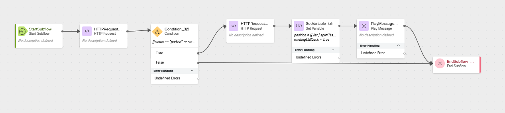
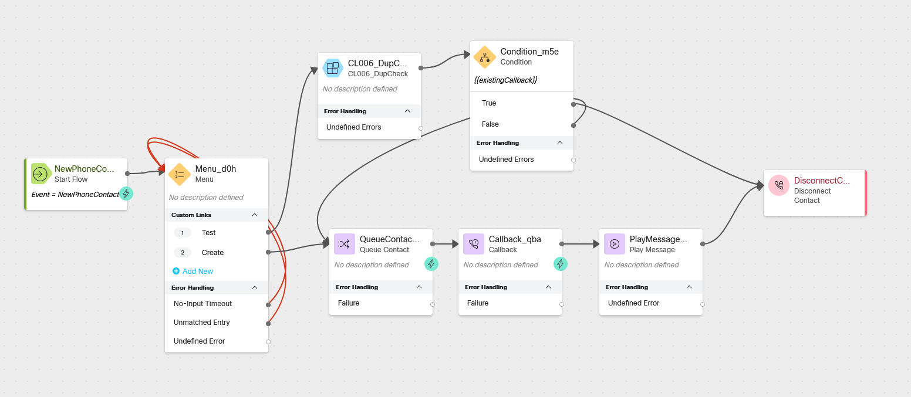

# Stopping Duplicate Callback Requests 

## Story
> When you have unexpectedly long wait times it is not uncommon for customers to call back in and create multiple callback requests.  In this lab we will identify callers which already have a callback in queue and we will let the caller hear their current position in the queue, so that they know when they can expect to receive a callback.


### High Level Explanation
1. We will create a Subflow which will make up to two API calls.
      1. The first call will check to see if there is an existing callback in queue for the callers phone number
      2. If there is a call in the queue already, the second API call will retrieve a list of calls then we will see where in line the call is and tell the caller.
2. We will also create a special Flow just for testing. 

---

## Preconfigured Elements
1. Connector for calling Webex Contact Center APIs

---

## Build
### Create a new Subflow
> Name: <copy>CL<w class="POD"></w>_DupCheck</copy>
> 
> 
---

### Create these Subflow Variables
> Name: <copy>TaskID</copy>
>
> Variable Type: <copy>String</copy>
>
> Input: false
>
> Output: false
>
> Default Value: empty
>
---

> Name: <copy>queueID</copy>
>
> Variable Type: <copy>String</copy>
>
> Input: false
>
> Output: false
>
> Default Value: empty
>
---

> Name: <copy>status</copy>
>
> Variable Type: <copy>String</copy>
>
> Input: false
>
> Output: false
>
> Default Value: empty
>
---

> Name: <copy>existingCallback</copy>
>
> Variable Type: <copy>Boolean</copy>
>
> Input: False
>
> Output: True
>
> Default Value: False
>
---

> Name: <copy>list</copy>
>
> Variable Type: <copy>String</copy>
>
> Input: false
>
> Output: false
>
> Default Value: empty
>
---

> Name: <copy>position</copy>
>
> Variable Type: <copy>Integer</copy>
>
> Input: false
>
> Output: false
>
> Default Value: <copy>0</copy>
>
---

> Name: <copy>ANI</copy>
>
> Variable Type: <copy>String</copy>
>
> Input: true
>
> Output: false
>
> Default Value: empty
>
---

### Add an HTTP Request node
> Select Use Authenticated Endpoint
>
> Connector: <copy>WxCC_API</copy>
> 
> Path: <copy>/search</copy>
> 
> Method: <copy>POST</copy>
> 
> Content Type: <copy>GraphQL</copy>
>
> Copy this GraphQL query into the request body:
> 
```GraphQL
query callbackCheck(
  $from: Long!
  $to: Long!
  $filter: TaskFilters
  $timeComparator: QueryTimeType
) {
  task(from: $from, to: $to, filter: $filter, timeComparator: $timeComparator) {
    tasks {
      id
      status
      lastQueue {
        id
      }
    }
  }
}
```
> Copy this into the Variables section:
``` JSON
{
    "from": "{{now()|epoch (inMillis=true) -86400000 }}",
    "to": "{{now()|epoch (inMillis=true)}}",
    "filter": {
        "and": [
            {
                "origin": {
                    "equals": "{{ANI}}"
                }
            },
            {
                "isActive": {
                    "equals": true
                }
            },
            {
                "isCallback": {
                    "equals": true
                }
            }
        ]
    },
    "timeComparator": "createdTime"
}
```
> 
> Parse Settings:
>
> Content Type: <copy>JSON</copy>
> 
> - Output Variable: <copy>queueID</copy>
> - Path Expression: <copy>$.data.task.tasks[0].lastQueue.id</copy>
> ---
> - Output Variable: <copy>status</copy>
> - Path Expression: <copy>$.data.task.tasks[0].status</copy>
> ---
> - Output Variable: <copy>TaskID</copy>
> - Path Expression: <copy>$.data.task.tasks[0].id</copy>
> ---

### Add a Condition node
> Connect the output from the previous HTTP Request node to this node
>
> Expression: <copy>{{status == "parked" or status == "connect"}}</copy>
>
> We will connect the False node in a future step.
>
> Connect the True node edge to the HTTP Request node created in the next step.
>
---


### Add an HTTP Request node
> Select Use Authenticated Endpoint
>
> Connector: <copy>WxCC_API</copy>
> 
> Path: <copy>/search</copy>
> 
> Method: <copy>POST</copy>
> 
> Content Type: <copy>GraphQL</copy>
>
> Copy this GraphQL query into the request body:
> 
```GraphQL
query PIQlist(
  $from: Long!
  $to: Long!
  $timeComparator: QueryTimeType
  $filter: TaskFilters
) {
  task(from: $from, to: $to, timeComparator: $timeComparator, filter: $filter) {
    tasks {
      id
    }
  }
}
```
> Copy this into the Variables section:
``` JSON
{
    "from": "{{now()|epoch (inMillis=true) - 86400000 }}",
    "to": "{{now()|epoch (inMillis=true)}}",
    "timeComparator": "createdTime",
    "filter": {
        "and": [
            {
                "isActive": {
                    "equals": true
                }
            },
            {
                "lastQueue": {
                    "id": {
                        "equals": "{{queueID}}"
                    }
                }
            }
        ]
    }
}
```
> 
> Parse Settings:
>
> Content Type: <copy>JSON</copy>
>
> - Output Variable: <copy>list</copy>
> - Path Expression: <copy>$.data.task.tasks..id</copy>
>
> ---

### Add a Set Variable node
> Variable: <copy>position</copy> 
> 
> Set Variable: <copy>{{ list | split(TaskID) | last | split(",") | length }}</copy>
>
> ---
>
> Variable: <copy>position</copy> 
>
> Set Variable: True
---

### Add a Play message node
> Activity Label: <copy>givePIQ</copy>
>
> Enable Text-To-Speech
>
> Select the Connector: Cisco Cloud Text-to-Speech
>
> Click the Add Text-to-Speech Message button
>
> Delete the Selection for Audio File
>
> Text-to-Speech Message: <copy>`<speak> You already have a callback in queue which is the <say-as interpret-as="ordinal"> {{position}} </say-as> call in line. You will receive a callback when it is your turn. Thank you. </speak>`</copy>
>
---

### Add an End Subflow node
> Connect the output node edge from the previous Play Message node to this End Subflow node
>
> Connect the False node edge from the Condition node to this End Subflow node

---


### <details><summary>Check your flow</summary></details>

---

### Publish your Subflow
> Turn on Validation at the bottom right corner of the flow builder
>
> If there are no Flow Errors, Click Publish
>
> Add a publish note
>
> Add Version Label(s): Live 
>
> Click Publish Flow

---

### Create a New Flow for testing
> Name: <copy>CL<w class="POD"></w>DupTester</copy>
>
---

### Add a new Menu node
> Activity Label: <copy>welcomeMenu</copy>
>
> Enable Text-To-Speech
>
> Select the Connector: Cisco Cloud Text-to-Speech
> 
> Click the Add Text-to-Speech Message button
> 
> Delete the Selection for Audio File
> 
> Text-to-Speech Message: <copy>Press 1 to check for an existing callback. Press 2 to queue a callback to load the test.</copy>
>
> Select Make Prompt Interruptible
> 
> Digit Number: 1 Link Description: <copy>Test</copy>
> 
> Digit Number: 2 Link Description: <copy>Create</copy>
> 
> Connect the No-Input Timeout node edge to the input node edge of this node
> 
> Connect the Unmatched Entry node edge to the input node edge of this node
> 
---

### Add a Subflow node for CL<w class="POD"></w>_DupCheck
> Subflow Label: <copy>Live</copy>
>
> Map Subflow Input Variables
>
>> Click Add New
>>
>> Current Flow Variable: <copy>NewPhoneContact.ANI</copy>
>>
>> Subflow Input Variable: <copy>ANI</copy>
> 
> 
> Map Subflow Output Variables
>
>> Click Add New
>>
>> Subflow Output Variable: <copy>existingCallback</copy>
>>
>> Current Flow Variable: <copy>existingCallback</copy>
> 
---

### Add a new Condition node
> Connect the output node edge from the Subflow node to this Condition node
>
> Expression: <copy>{{existingCallback}}</copy>
>
---

### Add a Disconnect Contact node
> Connect the True node edge from the Condition node to this Disconnect Contact node 
> 

---

### Add a Queue Contact node
> Connect the Create node edge from the Menu node added in the previous step to this node
> 
> Select Static Queue
>
> Queue: <copy><w class="Queue">yourQueueID</w></copy>
>

---

### Add a Callback node
> Connect the outbound node edge from the Queue Contact node to this Callback node
> 
> Callback Dial Number: <copy>NewPhoneContact.ANI</copy>
>
> Register callback to different location: Off
>
> Static ANI: leave empty
>
---


### Add a Play Message node
> Connect the Output node edge from the Callback node to this Play Message node
> 
> Activity Label: <copy>confirmCB</copy>
>
> Enable Text-To-Speech
>
> Select the Connector: Cisco Cloud Text-to-Speech
> 
> Click the Add Text-to-Speech Message button
> 
> Delete the Selection for Audio File
> 
> Text-to-Speech Message: <copy>You will receive a callback when it is your turn in the queue.</copy>
>
> Connect the output node edge from this Play Music node to the Disconnect Contact node.
>
---


### <details><summary>Check your flow</summary></details>

---

### Publish your Subflow
> Turn on Validation at the bottom right corner of the flow builder
>
> If there are no Flow Errors, Click Publish
>
> Add a publish note
>
> Add Version Label(s): Live 
>
> Click Publish Flow

---

### Map your flow to your inbound channel
> Navigate to Control Hub > Contact Center > Channels
>
> Locate your Inbound Channel (you can use the search): <copy><w class="EP"></w></copy>
>
> Select the Routing Flow: <copy>CL<w class="POD"></w>DupTester</copy>>
>
> Select the Version Label: Live
>
> Click Save in the lower right corner of the screen

---


## Testing
1. Launch the [Agent Desktop](https://desktop.wxcc-us1.cisco.com/) and log in using the Desktop option.
2. On your Agent Desktop, make sure your status is not set to available
      1. Using Webex, place a call to your Inbound Channel number <copy><w class="DN"></w></copy>
         1. Choose menu option 1
            1. You should take the path to receive a callback
      2. Using Webex, place another call to your Inbound Channel number <copy><w class="DN"></w></copy>
         1. Choose option 1 again
            1. You should hear that you have a callback pending, your position in the queue, and the call should disconnect
      3. Optional: Using a mobile device or other phone number, place a call to your Inbound Channel number <copy><w class="DN"></w></copy>
         1. Choose menu option 1
            1. You should take the path to receive a callback
      4. Optional: Using a mobile device or other phone number, place another call to your Inbound Channel number <copy><w class="DN"></w></copy>
         1. Choose menu option 1
            1. You should hear that you have a callback pending, your position in the queue, and the call should disconnect
??? note "If you made to optional call from another number"
      1. Go Available in the agent desktop
        1. Accept the call on the agent desktop and then answer the call in Webex
        2. End the call and change your status to not available before wrapping up the call
        3. Using a mobile device or other phone number, place another call to your Inbound Channel number <copy><w class="DN"></w></copy>
         4. Choose menu option 1
            1. You should hear that you have a callback pending, your position in the queue, and the call should disconnect
         5. Go available again, accept the call on the agent desktop, and then answer the call in Webex
            1. End the call, wrap up the call, and change your status to not available
??? note "If you did not make the optional call from another number"
        1. Go Available in the agent desktop
        1. Accept the call on the agent desktop and then answer the call in Webex
        2. End the call, wrap up the call, and change your status to not available


---

# Once you have completed the testing, go pick another adventure from the [Adventure Section](adventureList.md)