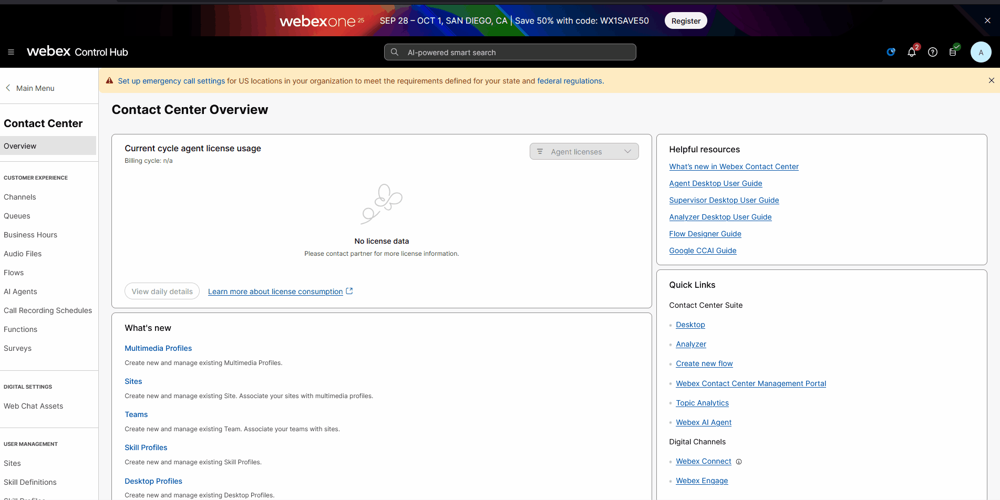
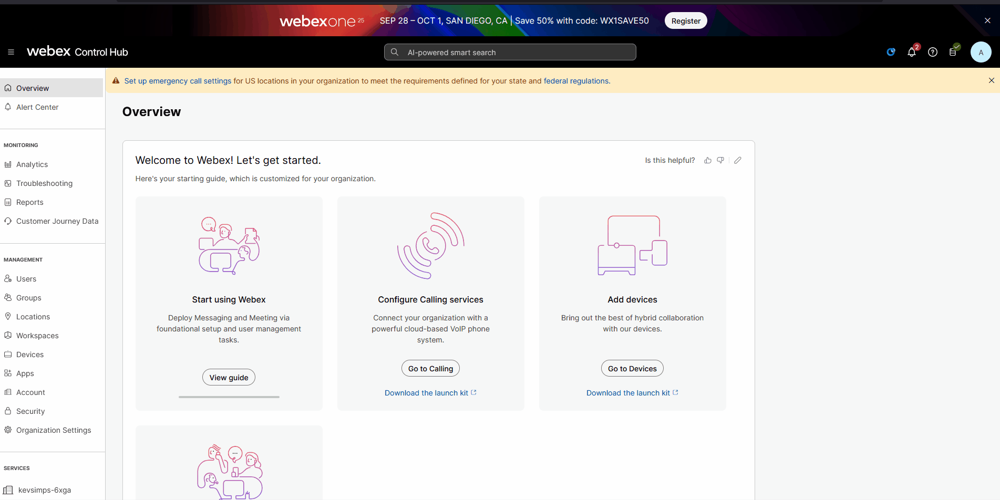

# Post Event Lab Setup

> Just because Cisco Live 2025 is over doesn't mean that you missed your chance to enjoy this lab.  However, you will need to create a few configuration items and import a couple of subflows on your gold tenant or on a sandbox tenant in order to get the full experience.  After you create the configuration items, update the form below with the appropriate values and click the update my details button and the lab guide will be personalized just for you!

---

## Download, Import, and Publish

### Subflows
> Use the links below to download the subflows which will be referenced in the labs, then import and publish them.  If you need guidance, click on the Show Me section.
>
> <a href="../assets/WaitTreatment.json" download>Wait Treatment</a>
>
> <a href="../assets/LTRCCT2296Callback.json" download>Callback</a>
>
> ??? Note "Show Me"    
    

---

### Functions
> Use the link below to download the Function which will be referenced in the labs, then import and publish it.  If you need guidance, click on the Show Me section.
>
> <a href="../assets/LOBwaitMessages.json" download>LOB Messages</a>
>
> ??? Note "Show Me"    
    

---

### Create a Reportable Global Variable

> Name: <copy>simulatedCSAT</copy>
>
> Type: Decimal
>
> Default Value: <copy>0.0</copy>
>
> Make Reportable: True
>
> Make Agent Viewable: True
>
> Desktop Label: <copy>Simulated CSAT</copy>
>
> Edit on Desktop: True
>
> ??? Note "Show Me"    
    

---

## Ensure that you have a Webex Contact Center connector configured
> Navigate to Integrations in the left pane of Control Hub
>
> Ensure that the connector Access selection is set to Read-Write Access
>
> If you do not have a connector configured, add one by clicking on Set Up
>
> ??? Note "Show Me"    
    

## Create Configuration Items 
Create the following configuration items and/or update the form below with the appropriate values, then click the "Update Lab Guide" button.

1. Create or repurpose an Inbound Voice Channel with an inbound number assigned to it.  
      1. Update the Channel name and inbound phone number in the form below
2. Create or repurpose a Licensed Contact Center Administrator account.
      1. Toggle Contact Center on
      2. Ensure that a Site and Desktop Profile are selected
      3. Save your changes 
3. Create or repurpose 2 teams (Team1 and Team2)
      1. Assign your User to both teams
      2. Update the team names in the form below
4. Create or Repurpose two Queues (Queue1 and Queue2)
      1. Assign Team1 to Queue1 and Team2 to Queue2
      2. Update the queue names in the form below
5. Click the Update Lab Guide button

---

<form id="info">
  <!-- <label for="POD">POD (okay to leave as default):</label>
  <input type="text" id="POD" name="POD" value="000">  -->

  <!-- <label for="Admin">Admin Login:</label>
  <input type="text" id="Admin" name="Admin"> 
  
  <label for="PW">Admin Password:</label>
  <input type="text" id="PW" name="PW">  -->
  
  <label for="EP">Inbound Channel Name:</label>
  <input type="text" id="EP" name="EP"> 

  <label for="DN">Inbound Channel Phone Number:</label>
  <input type="text" id="DN" name="DN"> 

  <label for="Queue">Queue 1 Name:</label>
  <input type="text" id="Queue" name="Queue"> 
  
  <label for="Queue2">Queue 2 Name:</label>
  <input type="text" id="Queue2" name="Queue2"> 

  <label for="Team">Team 1 Name:</label>
  <input type="text" id="Team" name="Team"> 

  <label for="Team2">Team 2 Name:</label>
  <input type="text" id="Team2" name="Team2"> 
   
  <button onclick="setValues()">Update Lab Guide</button>

</form>

